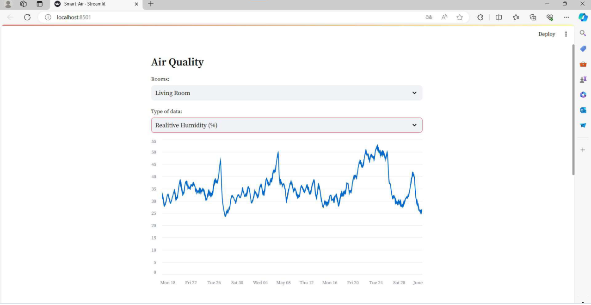
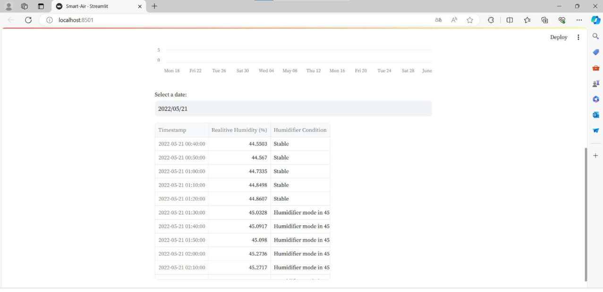

# Air-Smart Controller: Indoor Air Quality Prediction and Monitoring System




## 📋 Overview
The Air-Smart Controller project provides a deep learning-based solution for predicting and monitoring indoor air quality parameters in smart homes. This research addresses key limitations of current smart home systems:

- Over-reliance on real-time sensor data
- Limited adaptability to short-term user preference changes
- Lack of predictive capability for environmental changes

**Academic Publication:** Published in the *Journal of Artificial Intelligence and Human Sciences*

## 🔬 Research Methodology

### Dataset
Utilizes the **CN-OBEE dataset** containing:
- 1 year of data from a Chinese apartment
- Indoor environmental parameters (temperature, humidity, pressure)
- Outdoor weather conditions
- Occupancy patterns
- Power consumption data

*Dataset reference:* [CN-OBEE dataset on Springer Nature](https://www.nature.com/articles/s41597-023-02891-9)

### Prediction Models
Implemented in `Air_Quality_Prediction.ipynb`:
| Model | Advantages |
|-------|------------|
| GRU   | Computational efficiency |
| LSTM  | Handles long-term dependencies |
| BiGRU | Bidirectional context processing |

### Performance Metrics
- Mean Absolute Error (MAE)
- Mean Squared Error (MSE)
- Root Mean Squared Error (RMSE)

## 🖥️ Smart-Air Controller Interface
Features of `Smart-Air.py` (Streamlit-based):
- Visualize predicted parameters by room/type
- View forecasted automation interventions
- User override options ("Get Stable"/"Schedule")
- Configurable adjustment intervals (10min-24hr)


## 🚀 Installation and Usage

### Prerequisites
```bash
git clone https://github.com/yourusername/air-smart-controller.git
cd air-smart-controller

python -m venv venv
source venv/bin/activate  # Windows: venv\Scripts\activate

pip install -r requirements.txt
```
## Running Prediction Model
```bash
jupyter notebook Air_Quality_Prediction.ipynb
# OR
jupyter nbconvert --execute Air_Quality_Prediction.ipynb
```
## Launching Controller
```
streamlit run Smart-Air.py
```
## Repository Structure
```
air-smart-controller/
├── Air_Quality_Prediction.ipynb     # Prediction models
├── Smart-Air.py                     # Web application
├── predictions0-4.csv               # Room-specific predictions
├── 1.png                            # Dashboard screenshot
├── 2.png                            # Visualization screenshot
├── demo.pdf                         # Application demo
├── Air-Smart-Controller-Report.pdf  # Detailed analysis
├── README.md                        # This document
└── requirements.txt                 # Dependencies
```
## 📝 Citation
```
@article{author2023airsmart,
  title={Air-Smart Controller: Deep Learning-Based Indoor Air Quality Prediction and Control},
  author={Your Name},
  journal={Journal of Artificial Intelligence and Human Sciences},
  year={2023},
  doi={10.5281/zenodo.14670650}
}
```
## 🤝 Contributing
Contributions welcome! Please submit a Pull Request.

## 📄 License
MIT License - See LICENSE for details.

## 📬 Contact
Email: kadirqokdeniz@hotmail.com
